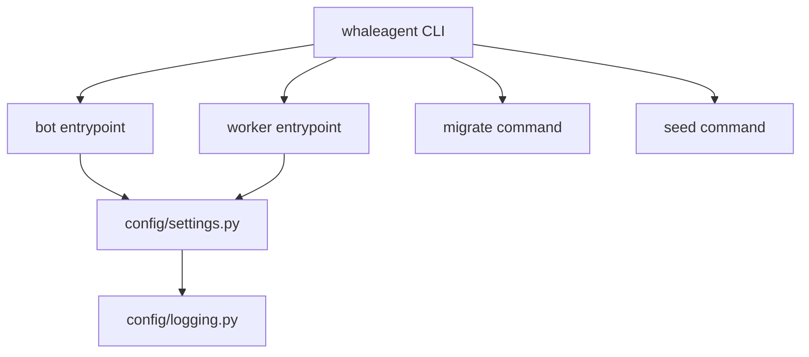

# WhaleAgent v0.1 — Build Plan

> Merged from `build plan file.md` (requirements) + session decisions.
> Written for an amateur AI engineer who wants to learn professional architecture.

---

## What are we building?

A Telegram bot that watches crypto "smart money" wallets, detects interesting on-chain activity, investigates using AI (LangGraph), and sends you alerts + daily briefings. Free tier with limits, paid tier for power users.

**Stack:** Python 3.11, aiogram 3, Pydantic v2, SQLAlchemy 2 + Postgres, Redis, LangGraph, Groq (LLM), structlog, Docker Compose.

---

## Architecture in plain English (Why hexagonal?)

Imagine a restaurant:

| Layer | Restaurant | Our code |
|-------|-----------|----------|
| **Domain** | Recipes, ingredients | Business rules: "free users can only track 3 wallets" |
| **Application** | Chefs preparing dishes | Use cases: "investigate this wallet movement" |
| **Adapters** | Waiters, suppliers, ovens | Bot interface, database, AI model, blockchain RPC |
| **Ports** | Menu interface, supplier contract | Python `Protocol` classes that define boundaries |

**Rule:** Chefs never talk to suppliers directly. Waiters never modify recipes. This keeps code testable and swappable. If we switch from Postgres to MySQL, we only touch `adapters/db/` — the recipes (domain) stay untouched.

---

## 11 Phases (Merged)

| Phase | What | Why this order |
|-------|------|----------------|
| **0** | Project scaffold, config, logging, CLI | Need foundation to run anything |
| **1** | Data models (domain + DB) + seed data | Define what we're working with |
| **2** | Database operations + billing rules | Need to store/retrieve + gate features |
| **3** | Blockchain data fetching + event scoring | The input pipeline |
| **4** | AI investigation graph (LangGraph) | The intelligence core |
| **5** | Business use cases + job queue | Orchestrate domain + AI |
| **6** | Telegram bot | The user-facing UI |
| **7** | Background workers | Poll blockchain, send alerts, briefing |
| **8** | Docker + Makefile + README | Package for deployment |
| **9** | Tests | Verify everything |
| **10** | Documentation sync | Keep docs matching code |
| **11** | Self-review + CHANGELOG | Ship it |

---

## Key decisions (with reasons)

### Why Groq + LangGraph?
- Groq is OpenAI-compatible, cheap, fast. `langchain-openai` `ChatOpenAI` + `.bind_tools()` works with LangGraph natively.
- Models: **cheap** = `llama-3.1-8b-instant` (formatting/guardrails), **strong** = `llama-3.3-70b-versatile` (reasoning/analysis).
- Retry sequence: 2s, 4s, 6s, 8s, 10s (max — prevents API overheat).

### Why arq + APScheduler?
- **arq**: async Redis-backed job queue for tasks (process event, send alert).
- **APScheduler**: cron scheduler for polling, daily briefing, cleanup.
- Both share one asyncio event loop in the worker process.

### Why MultiChainProvider?
- Alchemy, drpc, Ankr, QuickNode all have free tiers with rate limits.
- `MultiChainProvider` auto-failover: if one returns 429, switch to next.
- If no keys at all → `MockChainProvider` returns seed data.

### Why hexagonal layering?
- Swap adapters without touching business logic.
- Test domain logic without Postgres, Telegram, or AI.
- A solo founder can maintain this without getting lost.

---

## Deliverables checklist

- [ ] Runnable system (`docker compose up --build` → talk to bot)
- [ ] Run instructions in README + Makefile
- [ ] Mocked vs Real table (what works without keys)
- [ ] Current limitations documented
- [ ] Top 15 v0.2 tasks
- [ ] Architecture docs match code

---

## Phase 0: Scaffold + Config + Logging

Let me explain each file we're about to create:

- **pyproject.toml**: Poetry manifest — declares project name, python version, all dependencies.
- **config/settings.py**: Pydantic `BaseSettings` — reads env vars, validates them, provides typed access.
- **config/logging.py**: structlog setup — gives us JSON logs with correlation IDs (essential for debugging a distributed system).
- **main.py**: Click CLI — `whaleagent bot`, `whaleagent worker`, `whaleagent migrate`, `whaleagent seed`.

**Let's build it.**
